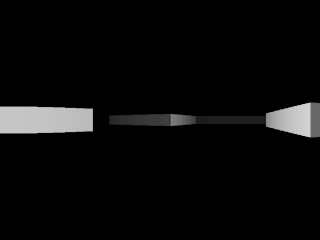
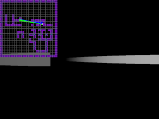
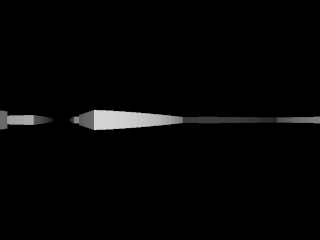

# Obsidian

  A primative 3d raycasting engine written in C++, using the Simple DirectMedia Layer (SDL) framework

  
## Overview

  This project is a recreation of how the rendering is done in games like Wolfenstein 3D.

  The implementation of the renderer is quite primitive, as the state it's currently in could use some work. But regardless, It's my first real attempt at learning and utilizing SDL into a program, on top of which, having to 
  use linear algebra concepts that I definitely needed some refreshers on. 

  I'll definitely go back to this project in the future, just slightly tired of working on it.

## Reqirements

  - g++

  ***SDL is already in the repository, so dont even worry about it.***

## Compiling

  Simply type ``make`` in the project directory, and it'll produce an executable labeled ``a`` which you can execute by entering ``./a``.

  ***This was made on Linux and wont run on Windows, sorry!***

## Controls
  ``TAB`` Toggle 2D map
  
  ``Q``/``E`` Turns camera left and right
  
  ``W``,``A``,``S``,``D`` Player movement 

  ``-``/``+``   Adjusts field of view (FOV)

  ``[``/``]``   Adjusts render distance (RD)

  ``,``/``.`` Adjusts number of columns rendered on screen

## Screenshots
https://youtu.be/-6CU9t_aTPk

  

